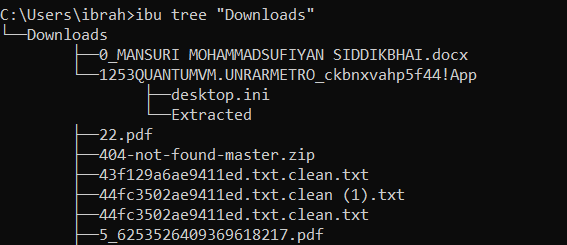
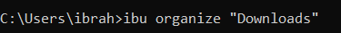
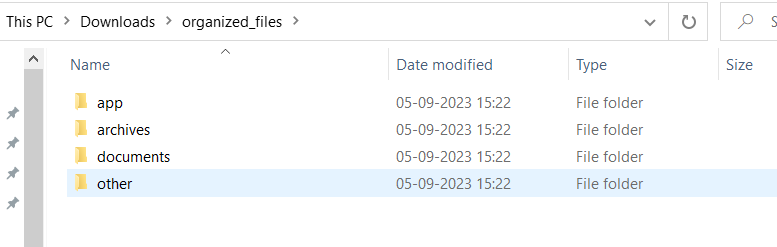

<!-- TABLE OF CONTENTS -->

## Table of Contents

- [Overview](#overview)
- [Built With](#built-with)
- [Features](#features)
- [Contact](#contact)

<!-- OVERVIEW -->

## Overview





- Automate organization of files in it's respective folder, it also remove duplicate files.

### Built With

- The project is built using Node.js

## Features

- The tree function is designed to display a directory tree structure.

Here's how it works:

1. First t determines whether the current item in the directory is a file or a subdirectory, If it's a file, it prints the file name with appropriate indentation, If it's a subdirectory, it prints the subdirectory name with appropriate indentation and then recursively calls itself on the subdirectory.

2. Indentation: Indentation is used to visually represent the directory hierarchy. It adds tabs (\t) to the indentation string for each level of nesting.

- The organize function is responsible for organizing files in a directory into specific categories.

Here's how it works:

1. It defines the destPath where the organized files will be placed. By default, it uses a subdirectory named "organized_files" within the specified directory (dirName).

2. Creating Destination Directory: If the destination directory doesn't exist, it creates it using fs.mkdirSync().

3. It reads all the items (files and subdirectories) in the source directory, For each item, it determines whether it's a file using fs.lstatSync().isFile(), If it's a file, it calls a getCategory function to determine its category (e.g., media, archives, documents), It moves the file to the corresponding category subdirectory within the destination directory. It deletes the original file from the source directory. (If you don't want to delete original file comment out fs.unlinkSync(file) in sendFiles() function).

4. Category Determination: The getCategory function determines the category of a file based on its file extension. It compares the file extension with predefined lists of extensions for different categories and returns the appropriate category.

## How To Use

<!-- This is an example, please update according to your application -->

To clone and run this application, you'll need [Git](https://git-scm.com) and [Node.js](https://nodejs.org/en/download/) (which comes with [npm](http://npmjs.com)) installed on your computer. From your command line:

```bash
# Clone this repository
$ git clone [https://github.com/Ibrahim-Payak/windbnb]

# Run the command
$ ibu tree/organize 'directoryPath'
```

## Contact

- GitHub [@IbrahimPayak](https://github.com/Ibrahim-Payak)
- LinkedIn [@IbrahimPayak](https://www.linkedin.com/in/ibrahim-payak-6b8445174/)
